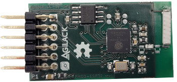
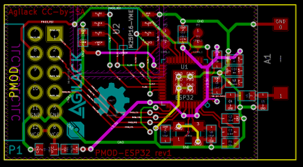
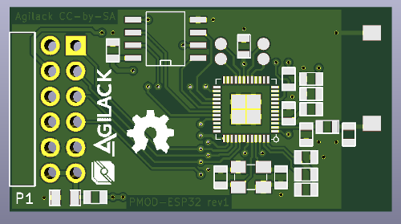
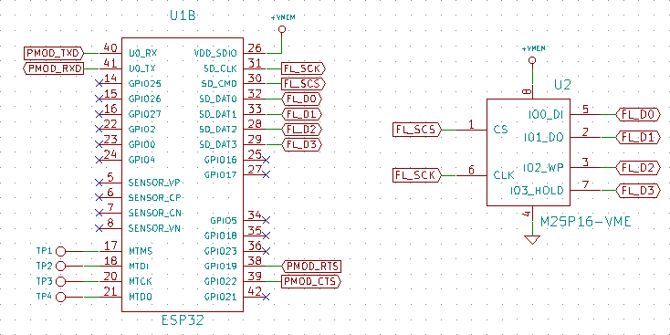

PMOD Wifi ESP32
===============

This project is a PMOD module that allow to add a wireless wifi interface to a
project.

! ! ! ! Major bug into rev1 (see below)

Known bugs
----------

 - Communication with external flash does not work so it is not possible to
   boot from flash on rev1 ! The signal numbers "0" to "3" as seen into
   datasheet have been used (see fig below) but this mapping is invalid.

