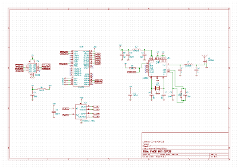
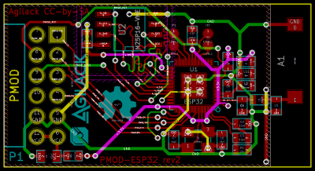
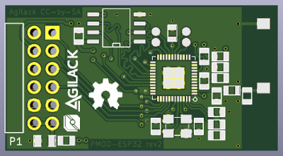

PMOD Wifi ESP32
===============

This project is a PMOD module that allow to add a wireless wifi interface to a
project.

CAD source
----------

This board has been designed using KiCad EDA (version 5). All sources files
(schematics, routing, ...) are available into the `prj-kicad` folder. You can
re-use this design under terms of the Creative Commons ShareAlike license
(CC BY-SA)

<table>
<tr>
<td></td>
<td></td>
</tr>
<tr>
<td>Fig1: Preview of the KiCad schematics</td>
<td>Fig2: Preview of the KiCad routing</td>
</tr>
</table>

Previous version (rev1)
-----------------------

A major hardware bug into external flash memory routing have been found into
previous version. The rev1 must be considered unusable. More informations
about this bug is available into history (see tag `rev1`)

